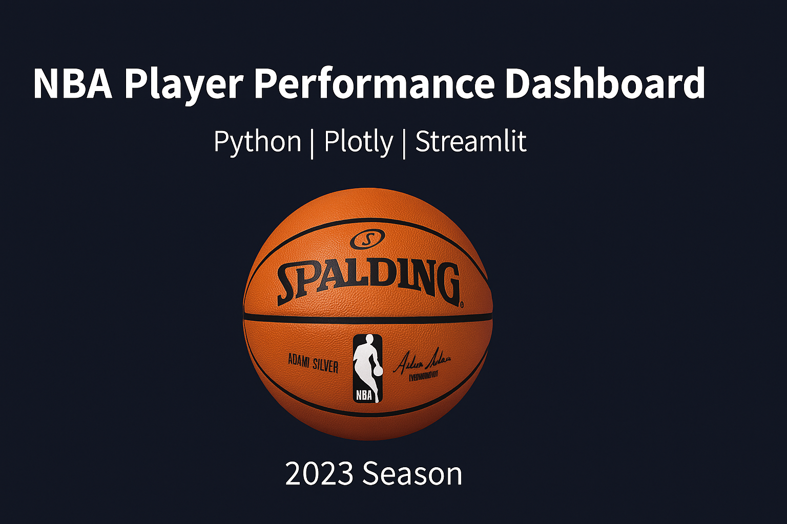

<p align="center">
  
</p>

## 🏀 NBA Player Performance Dashboard

An interactive data analytics dashboard built with **Python**, **Pandas**, **Plotly**, and **Streamlit**, designed to analyze and visualize NBA 2023 player statistics.
The project explores player and team performances, integrates a lightweight machine learning model, and delivers clear visual insights through a modern, dynamic interface.

---

### 📊 Features

* **Player Statistics Dashboard** – Interactive filtering by team and games played.
* **Dynamic KPIs** – Displays player count, average PPG, and top performers.
* **Search & Compare** – Search for individual players or compare two teams head-to-head.
* **Logo Integration** – Auto-resized and displayed official team logos for a polished experience.
* **Mini Machine Learning Model** – Predicts *expected points per game (PPG)* using Linear Regression based on rebounds, assists, and minutes.
* **Visual Animations** – Smooth fade-in effects and interactive bar charts powered by Plotly.

---

### 🧠 Tech Stack

| Category            | Tools                                       |
| ------------------- | ------------------------------------------- |
| Programming         | Python 3.12                                 |
| Libraries           | Pandas, NumPy, Plotly, scikit-learn, Pillow |
| Dashboard Framework | Streamlit                                   |
| Data Source         | Kaggle NBA 2023 Player Stats                |
| Version Control     | Git & GitHub                                |

---

### ⚙️ Installation

Clone the repository and install dependencies:

```bash
git clone https://github.com/ShubhamAC20/nba-player-performance-dashboard.git
cd nba-player-performance-dashboard
pip install -r requirements.txt
```

Or manually install key libraries:

```bash
pip install streamlit pandas plotly scikit-learn pillow
```

Run the app locally:

```bash
streamlit run app.py
```

Then open the link shown in your terminal (usually [http://localhost:8501](http://localhost:8501)).

---

### 📁 Project Structure

```
nba-player-performance-dashboard/
│
├── app.py                        # Main Streamlit dashboard
├── 2023_nba_player_stats.csv     # Player stats dataset
├── assets/
│   ├── logos/                    # Team logos (resized 64x64)
│   └── resize_logos.py           # Helper script for logo resizing
├── README.md                     # Project documentation
└── requirements.txt              # Dependencies (optional)
```

---

### 💡 Insights

* The top scorer in the 2023 dataset can be identified interactively via the dashboard.
* League averages (like FG% or PPG) update dynamically with filters.
* Team-level comparisons visualize differences in offensive and defensive metrics.
* The built-in model helps understand how performance metrics impact expected scoring.

---

### 🎓 Academic Relevance

This project demonstrates end-to-end data handling — from ingestion and transformation to modeling and visualization.
It showcases skills in:

* Data analysis & cleaning with **Pandas**
* Visualization & dashboard design using **Plotly** and **Streamlit**
* Predictive modeling using **scikit-learn**
* UI logic & presentation for interactive storytelling

**Ideal for Master’s programs like Big Data Analytics at UC3M**, where practical application and technical fluency matter.

---

### 🌐 Future Enhancements

* Add REST API data fetch for live game stats
* Integrate advanced ML models (Random Forest / XGBoost)
* Deploy the dashboard on Streamlit Cloud
* Add dark/light mode and user analytics tracking

---

### ✨ Author

**Shubham Acharya**
Data Analyst | Power BI | SQL | Python | Aspiring Data Scientist
📍 Based in India
📫 [LinkedIn](https://www.linkedin.com/in/shubhamacharyaanalyst/) • [GitHub](https://github.com/ShubhamAC20)

---

### 🏁 License

This project is open source under the **MIT License** — free to use, modify, and share with attribution.

---

### ✅ Quick Copy

You can just copy this entire section into your `README.md` file.
Once done, commit and push it:

```bash
git add README.md
git commit -m "Added professional README"
git push
```
